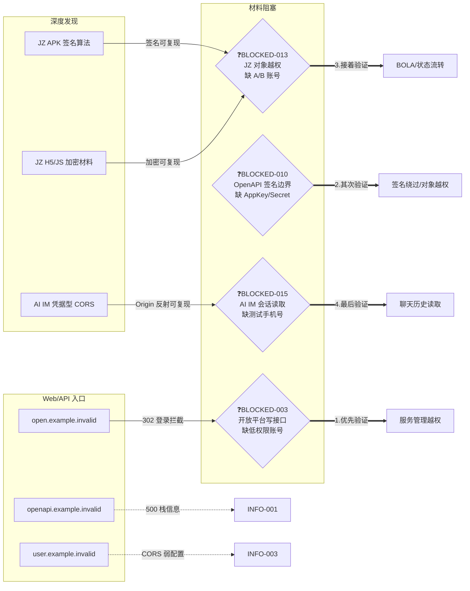

# Codex Handoff And Asset Docs Skill

本文件用于 Codex 在项目内生成可交接的任务文档和资产文档。触发场景包括用户要求“生成交接文档”、“接手文档”、“接手说明”、“资产文档”、“资产信息文档”、“资产清单”、“任务日志”、“漏洞归档”，或要求新窗口/别的 Agent/其它 AI 快速接手当前任务。

证据保存、敏感字段、报告引用和匿名化统一遵循 [`../policies/evidence-data-handling.md`](../policies/evidence-data-handling.md)。本文件定义文档结构，不另设平行的数据处理规则。

## 输出目标

默认生成或更新一个可接手归档包，除非用户明确只要其中一种：

- 交接文档：让后续 Agent 不依赖会话记忆即可继续工作。
- 资产文档：汇总授权范围、委托书资产、已探明资产、技术栈、入口、接口、风险线索和证据位置。
- 任务日志：保留执行过程、关键命令、阶段结论、阻塞点和续跑 checkpoint。
- 漏洞归档：统一保存确认漏洞、候选风险、低风险、阴性边界和受限未验证项。

安全测试、资产探测、信息收集类任务应写入对应任务归档目录：

```text
tasks/YYYY-MM-DD-HHMM-short-task-name/
```

固定主文件名：

- `notes/log.md`
- `notes/loaded-skills.md`
- `outputs/agent-handoff-pentest-status.md`
- `outputs/asset-inventory-detailed.md`
- `outputs/asset-inventory.json`
- `vulnerability-archive.md`
- `outputs/vulnerability-archive.json`

如果文件已存在，优先更新原文件并修正过期或矛盾信息；只有用户明确要求快照时才新建带日期或序号的文件。快照统一放入 `outputs/archive/YYYYMMDD-HHMMSS-<canonical-name>.md`，并在 `outputs/agent-handoff-pentest-status.md` 注明快照原因。

## 目录和命名规范

安全测试、资产探测、目标信息收集、漏洞验证、赏金挖掘和 Web/API 测试任务必须使用以下目录结构，便于新窗口或其它 AI 直接接手：

```text
tasks/YYYY-MM-DD-HHMM-short-task-name/
  inputs/
  notes/
    log.md
    loaded-skills.md
  outputs/
    agent-handoff-pentest-status.md
    asset-inventory-detailed.md
    asset-inventory.json
    vulnerability-archive.json
  evidence/
    restricted/
    http/
    screenshots/
    scan/
    burp/
    js/
    files/
    callbacks/
  reports/
  temporarytool/
  vulnerability-archive.md
  retrospective.md
```

命名规则：

- `notes/log.md` 是唯一主过程日志；不要新建 `log2.md`、`notes.md`、`过程.md` 分散状态。
- `outputs/asset-inventory-detailed.md` 是唯一主资产文档；结构化资产同步到 `outputs/asset-inventory.json`。
- `vulnerability-archive.md` 是唯一主漏洞/风险总账；结构化风险同步到 `outputs/vulnerability-archive.json`。
- 所有漏洞/风险条目必须按 `agent/skills/漏洞评级.md` 写入 `rating_review`；缺少评级复核的条目只能作为候选、信息项或受限未验证，不得写入有效中危/高危。
- `outputs/agent-handoff-pentest-status.md` 是唯一新窗口/其它 AI 接手入口。
- 原始证据按类型写入 `evidence/` 子目录；含可重放秘密或完整业务值的证据进入 `evidence/restricted/`。文件名使用 `YYYYMMDD-HHMMSS_asset_short-purpose.ext`，避免空格、个人用户名、主机名、个人路径或其它测试人员标识。
- 任务专用临时脚本放入 `temporarytool/`；可复用脚本才考虑提升到仓库 `tool/` 并在 `agent/AGENT.md` 注册。

新窗口接手读取顺序：

1. `outputs/agent-handoff-pentest-status.md`
2. `notes/log.md`
3. `outputs/asset-inventory-detailed.md`
4. `vulnerability-archive.md`
5. `outputs/bounty-candidates.md` / `outputs/bounty-candidates.json`（如存在）
6. 必要证据索引和原始证据

## 工作流程

1. 先确认任务归档目录。安全测试/资产探测/信息收集任务必须使用 `tasks/YYYY-MM-DD-HHMM-short-task-name/`。
2. 读取项目规则：`AGENTS.md`、`agent/AGENT.md`，以及当前任务相关 skill。
3. 收集源材料：
   - 委托书、授权书、`authorization.md`、`scope.md`、目标清单。
   - 前期信息收集：`previous-recon-summary.md`、`previous-targets.md`、爬虫输出。
   - 当前结果：漏洞报告、JSON 证明、扫描输出、人工记录。
   - 证据目录：HTTP body/header、截图、提取的 JS、日志、脚本输出。
4. 先建立事实边界：
   - 哪些资产在授权内。
   - 哪些 IP/域名是测试方、回连方、第三方或需排除项。
   - 哪些结果是已确认、未确认、仅版本命中、误报或不可信。
   - 哪些操作因安全边界未执行，例如未写入、未订阅、未发布、未读取敏感数据。
5. 生成或更新 `notes/log.md`，至少补齐当前 checkpoint、关键命令、阶段结论和阻塞点。
6. 生成或更新 `outputs/asset-inventory-detailed.md` 和 `outputs/asset-inventory.json`。
7. 生成或更新 `vulnerability-archive.md` 和 `outputs/vulnerability-archive.json`。
8. 生成或更新 `outputs/agent-handoff-pentest-status.md`。
9. 读回关键段落核对：范围、排除项、核心结论、证据路径、后续建议。

## 安全测试交接规则

生成安全测试、资产探测或信息收集类交接档案时，必须纳入当前任务发现的所有漏洞、风险和线索：

- 已确认漏洞必须写入交接文档正文，并标注严重性、状态、证据路径、影响、复现条件和下一步。
- 中风险及以上发现必须同时出现在交接文档和正式报告或阶段性报告索引中。
- 低风险、信息泄露、配置缺陷、弱信号、扫描器线索、未确认候选和受限未验证项也必须写入交接档案；可放在“低危/信息泄露/未确认线索”章节或附录索引中，但不能省略。
- 每条风险都要保留当前状态：已确认、未复现、受限未验证、疑似误报、需账号验证、需追加授权、已纳入报告或仅内部归档。
- 不要把漏洞孤立列点；交接文档应记录风险之间的关联关系、可组合攻击链、已尝试组合方式、失败原因和后续优先尝试方向。
- 对敏感文件下载风险、需要 SMS 验证码的流程、可疑上传/下载点、认证/越权边界和对象存储线索，应单独标记，方便接手者继续验证。
- 如果证据文件很多，可以用表格和证据目录索引归组，不必粘贴所有响应正文；但每条风险必须能追溯到证据位置或说明为什么暂无证据。

## 交接文档结构

交接文档必须让后续 Agent 少走弯路。建议包含：

- 任务元信息：日期、任务目录、授权窗口、源文件。
- 授权范围与排除项：目标列表、测试方 IP、操作限制。
- 当前核心结论：已确认发现、严重性、证据文件、未证明内容。
- 每个资产的状态：
  - 目标 URL/IP
  - 技术栈
  - 已探测入口和方法
  - 已确认结果
  - 未确认线索
  - 证据路径
  - 推荐下一步
- 有效路径：哪些方法和参数有效。
- 无效路径：误报、死路、噪声工具、不稳定扫描结果。
- 已探测风险：已确认、低/中危线索、未确认候选。
- 全量风险索引：覆盖高/中/低/信息泄露/未确认/受限未验证/疑似误报，并标注是否进入正式报告。
- 攻击链关联：哪些低危或中危发现可与其它发现组合，当前证据缺口是什么。
- 未探测内容：需要账号、需要追加授权、因安全边界刻意未做的内容。
- 推荐接手方向：优先级排序和避免重复事项。
- 快速复现命令：仅包含授权、最小、非破坏性命令。
- 脚本说明：任务内一次性脚本与可复用脚本的区别。

安全测试场景必须写清楚：

- 已证明什么。
- 未证明什么。
- 未执行哪些敏感动作。
- 哪些结论不能扩大表述。

## 安全测试交接文档中的 Mermaid 攻击面拓扑图

`outputs/agent-handoff-pentest-status.md` 必须包含一张 **Mermaid 攻击面拓扑图**，置于 `## 当前风险索引` 上方。目的：接手 AI 通过结构化 DSL 秒级解析攻击面全景和阻塞点，无需线性通读全文。

### 节点命名规范（机读优先）

- 节点 ID 使用业务含义的短横线命名，如 `bc003`、`jz_h5`、`openapi`，不使用 A/B/C 无意义 ID
- 方框 `[]` = 资产/入口/候选
- 菱形 `{}` = 阻塞点，内部以 `❓` 前缀标注缺失材料
- 圆角 `()` = 信息项/已归档
- 实线 `-->` = 已验证链路
- 虚线 `-.->` = 未验证/降级链路
- 粗线 `==>` = 拿到材料后优先验证序列

### 模板



### 规则

- 图中只画拓扑关系，不写证据细节（证据在文字章节已有）
- 阻塞点菱形必须写明缺失的具体材料
- 验证序列用 `==>` 粗线按优先级编号
- 图源码直接嵌入 Markdown，不依赖外部文件渲染

## 任务日志结构

`notes/log.md` 必须能回答“任务为什么这样推进”和“下一步从哪里继续”。建议包含：

- 任务元信息：任务目录、开始时间、授权范围、操作者注意事项。
- 已加载规则和 skill：文件路径、触发原因、适用边界。
- 当前计划和任务拆分：每个阶段的状态、完成条件、停止条件。
- 关键命令和工具：命令、输入、输出文件、重要参数、是否低影响。
- 关键观察和假设：资产、接口、响应差异、误报判断。
- 阶段结论：已完成、未完成、受限项、证据位置。
- 续跑 checkpoint：下一条应执行的动作、前置材料、不要重复的失败路径。

### 格式模板

每条记录以时间戳标题开头，包含动作、观察、决策、证据。

```markdown
## YYYY-MM-DD HH:MM

- 动作：对 <目标> 执行 <方法>。
- 命令：`curl --resolve ...` / `python probe.py --input ...` / ...
- 关键观察：状态码分布（200 x N, 404 x M, 超时 x K）、响应差异、数量级。
- 决策：归档为 <INFO-xxx> / 升级为候选 / 中止该方向（原因）。
- 工具修正（如有）：修复 <脚本名> 的 <bug>，重跑批次。
- 证据：`evidence/scan/xxx.json`、`evidence/http/xxx/`。
```

每条 5-8 行，保留完整的"做了什么 → 看到了什么 → 决定了什么"链条。遇到工具 bug 修复、方法论调整也记录在对应时间戳下。

`notes/log.md` 不替代资产文档或漏洞归档；涉及资产和风险时引用资产 ID、风险 ID 和证据路径。

## 资产文档结构

资产文档应合并“委托书资产”和“已探明资产”。建议包含：

- 授权资产总览：
  - 委托方、被委托方、测试窗口。
  - 乙方/测试方 IP 或其他排除资产。
  - 委托书中的系统列表表格。
- 已探明资产总表：
  - 资产名称
  - 授权地址
  - 解析主机/IP
  - 主要技术栈
  - 当前风险/状态
- 每个资产详情：
  - 委托书信息：单位、系统名称、系统地址、类型。
  - DNS、CNAME、IP、端口。
  - TLS/证书信息。
  - HTTP Server、框架、前端库、后端指纹。
  - 页面标题和业务/组织背景。
  - 登录入口、后台入口、API、上传/下载、WebSocket、消息队列等。
  - 已确认风险与未确认线索。
  - 证据路径。
  - 后续资产补全方向。
- 其他本地资产：
  - 输入文件。
  - 输出报告。
  - 证据目录。
  - 任务脚本。
- 排除和不可信信息：
  - 测试方 IP。
  - fake-open 端口扫描。
  - WAF/错误页。
  - SPA fallback 200。
  - 仅版本命中但无行为证明的模板结果。

文件很多时不要逐个堆砌所有证据文件，优先按目录和输出类型归组；只有关键证据需要列具体文件。

`outputs/asset-inventory.json` 推荐结构：

```json
[
  {
    "asset": "https://example.com",
    "type": "web",
    "source": "scope|dns|cert|crawler|js|manual",
    "in_scope": true,
    "status": "alive|dead|blocked|unknown",
    "priority": "P0|P1|P2|P3",
    "evidence": ["evidence/http/20260609-120000_example-home.headers.txt"],
    "next_action": "继续认证流程验证"
  }
]
```

## 漏洞归档结构

`vulnerability-archive.md` 是风险总账，必须记录所有确认漏洞、候选风险、低风险、信息泄露、配置缺陷、阴性边界和受限未验证项。每条记录建议包含：

- 风险 ID：`VULN-001`、`RISK-001`、`INFO-001` 或 `BLOCKED-001`。
- 标题：`[资产/模块] + [漏洞类型] + [影响对象]`。
- 状态：`confirmed`、`verifying`、`blocked_need_material`、`false_positive`、`downgraded`、`no_impact`、`archived`。
- 评级：高危、中危、低危、信息项或未定级。
- 评级复核：必须引用 `agent/skills/漏洞评级.md`，写清实际危害、误报过滤、不予奖励过滤、证据闭合、业务影响、对应评级条款、为什么不是更高等级、为什么不是更低等级、最终复核结论。
- 资产和入口：URL/IP、接口、方法、认证状态。
- 证据摘要：请求方法、路径、状态码、关键响应字段、数量级、对照结果、验证边界。
- 影响判断：已证明影响、未证明影响、不可扩大表述。
- 复现条件：账号、角色、参数、测试数据、网络前提。
- 证据路径：原始响应、截图、Burp 项、扫描输出。
- 修复建议和报告去向：正式报告、阶段报告、仅内部归档或等待材料。

`outputs/vulnerability-archive.json` 推荐结构：

```json
[
  {
    "id": "RISK-001",
    "title": "后台登录接口账号枚举线索",
    "asset": "https://example.com/admin/login",
    "severity": "low",
    "status": "verifying",
    "evidence": ["evidence/http/20260609-121000_admin-login.json"],
    "impact": "可区分账号存在性，尚未证明批量影响",
    "rating_review": {
      "standard_file": "agent/skills/漏洞评级.md",
      "actual_harm": "尚未证明真实账号批量影响",
      "false_positive_filter": "弱证据，未闭合到账号接管或敏感数据读取",
      "business_impact": "当前仅为认证流程观察",
      "evidence_closure": "已有状态码和错误提示对照，缺少授权账号样本",
      "severity_basis": "未满足中危有效影响，暂按低危观察/候选",
      "not_higher_reason": "未证明账号接管、越权或敏感数据泄露",
      "not_lower_reason": "存在账号存在性差异，仍需归档跟踪",
      "final_severity": "low",
      "review_result": "downgraded"
    },
    "next_action": "需要授权测试账号做低频对照",
    "report_target": "internal_archive"
  }
]
```

## 表述规则

- 默认使用中文，除非用户明确要求其他语言。
- 不编造缺失数据；用“未探明”、“未确认”、“仅版本命中”、“需要账号验证”、“需要追加授权”。
- 漏洞结论必须基于行为证据，不只基于版本、标题、模板命中或状态码。
- 资产信息要区分授权资产、发现资产、关联资产、排除资产。
- 任务文档默认只记录敏感字段的类型、长度、脱敏摘要或不可逆指纹，并引用 `evidence/restricted/` 中的相对路径和 SHA-256；若明确要求自包含原值，整份交付物按受限原始证据管理，不进入 Git 或可复用知识。
- 对高危安全结论要避免扩大：
  - 能登录消息队列不等于能登录业务后台。
  - 能上传文件不等于 RCE。
  - CORS 配置异常不等于浏览器可读敏感响应。
  - nmap all-open 不等于真实端口开放。

## 最终回复

最终回复只给高信号摘要：

- 说明生成或更新了哪些文档。
- 给出可点击路径。
- 提及重要修正、假设或缺口。
- 不粘贴全文，除非用户明确要求。
